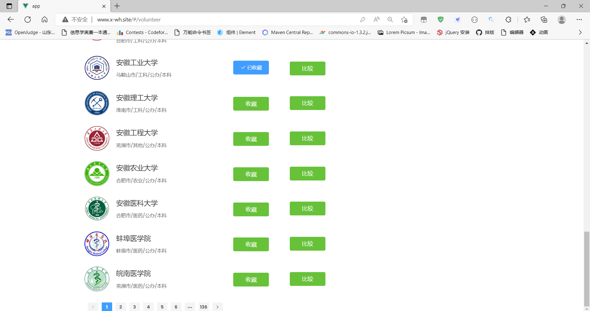
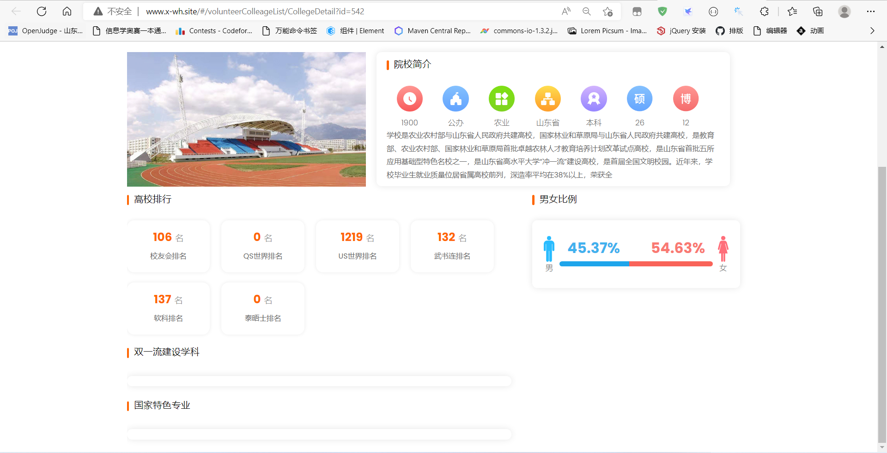
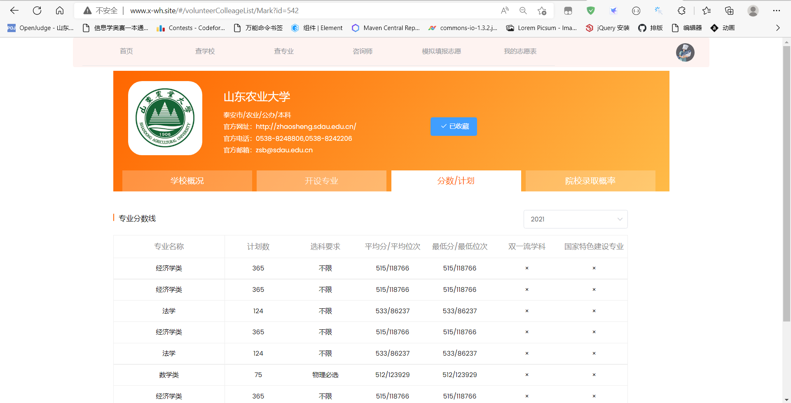
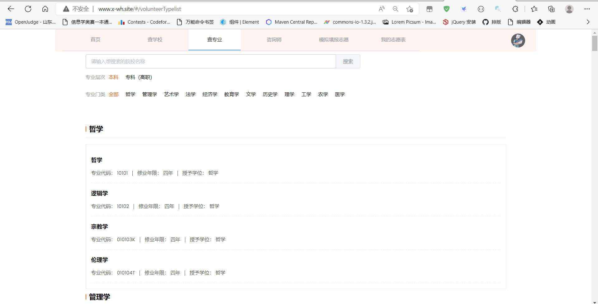

## 计算机毕业设计SpringCloud+大模型微服务高考志愿填报推荐系统 高考大数据 SparkML机器学习 深度学习 人工智能 Python爬虫 知识图谱

## 要求
### 源码有偿！一套(论文 PPT 源码+sql脚本+教程)

### 
### 加好友前帮忙start一下，并备注github有偿微服务高考推荐
### 我的QQ号是2827724252或者798059319或者 1679232425或者微信:bysj2023nb

# 

### 加qq好友说明（被部分 网友整得心力交瘁）：
    1.加好友务必按照格式备注
    2.避免浪费各自的时间！
    3.当“客服”不容易，repo 主是体面人，不爆粗，性格好，文明人。
## 创新点：
微服务SpringCloud分布式、Vue.js前后端分离、阿里云短信验证码、邮箱验证码、SparkML ALS机器学习推荐算法、Python爬虫、阿里云图片存储、百万数据量
## 高考志愿智能辅助决策系统总体架构如图1所示，包括七个功能模块：
查询功能：负责用户查找自己感兴趣的高校或专业志愿等；
模拟志愿填报：负责为用户提供录取概率以及协助用户选择志愿等；
高考资讯：负责为用户提供必要的高考资讯以及高考大数据；
高考咨询师：负责为用户提供以及推荐合适的高考志愿填报咨询师；
个人中心：用户管理自己的信息，管理自己的院校、专业收藏列表，调整自己的志愿列表；
用户登录：为用户提供账号登录功能；
用户注册：根据用户所提供的信息为用户生成专属的账号。
2020年以来，山东参与了新高考改革，志愿填报又成为了家长与考生的新难题。面对这种情况，许多高考志愿辅助填报系统如雨后春笋层出不穷，可见其重要性与必要性。截止到2022年，今年是山东省新高考制度实施的第三个年头。从前两年的高考志愿填报来看，新高考制度以及新的志愿填报方式大大降低了志愿填报的滑档率，让更多的考生不辜负自己的努力，考上了对的起自己分数的高校。
尽管新高考制度带来了大量的优势，但是采用新高考志愿的填报的一些外在弊端也展示出来，对于2022届考生而言，他们可以用来参考的数据只有2020年、2021年这两年，由于缺乏往年志愿填报的参照，而且对信息的把控也不能很好的整合，所以仍存在一部分考生拿着不该滑档的成绩滑档。为此，为响应山东省软件设计大赛号召以及帮助更多的山东考生适应新高考制度、完成高考志愿决策和填报，我们设计了本高考志愿智能决策系统，为山东学子提供院校查询、专业查询、模拟志愿填报等功能。
## 演示视频
https://www.bilibili.com/video/BV1hLSJYMEaF/?spm_id_from=333.999.0.0

## 运行截图

